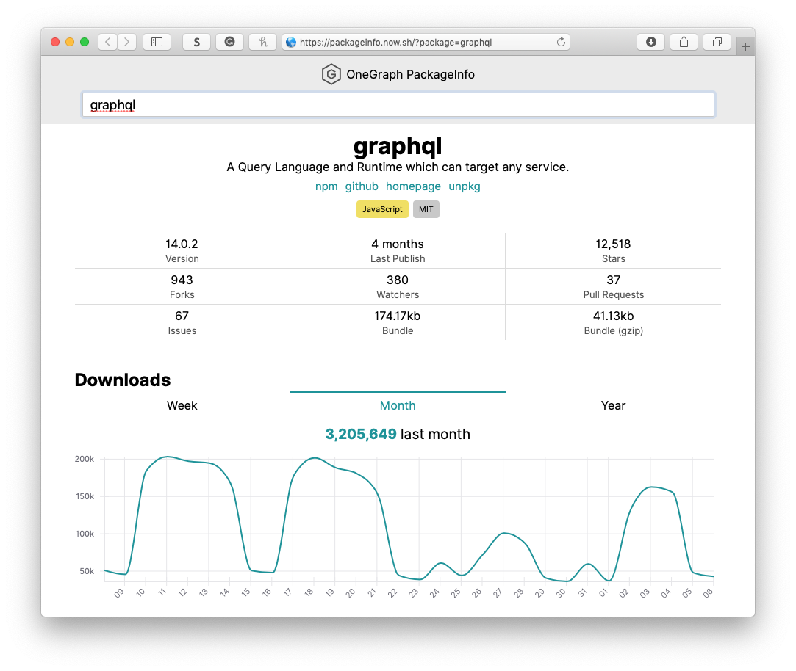

# [PackageInfo](https://packageinfo.now.sh)

PackageInfo is a service that provides detailed information about [npm packages](https://www.npmjs.com) using [OneGraph](https://www.onegraph.com). It combines both information from [npm](https://www.npmjs.com) and [Github](http://github.com).



## Stack
PackageInfo is built with a set of modern web technologies.

* [OneGraph](https://www.onegraph.com): A service that seamlessly connects many services in a single GraphQL API. It provides all the package information from npm and Github in a single request!
* [onegraph-auth](https://www.onegraph.com/docs/logging_users_in_and_out.html#log-the-user-in): A library that handles Authentication with OneGraph.
* [React](http://reactjs.org): A library for component-based user interfaces.
* [Next](http://nextjs.org): A framework for React-powered web applications
* [Now](https://zeit.co): A platform for serverless application deployment used to serve PackageInfo.
* [Apollo](https://www.apollographql.com): A leading client for GraphQL backends that connects OneGraph with PackageInfo.
* [Fela](http://fela.js.org): A CSS in JS styling library that renders to Atomic CSS.
* [react-vis](https://github.com/uber/react-vis): A visualization library for React used to render the download graphs.
* [react-markdown](https://github.com/rexxars/react-markdown): A library that renders Markdown to React components used to render the Readme. 
* [react-markdown-github-renderers](https://github.com/rexxars/react-markdown-github-renderers): A set of react-markdown renderers providing GitHub-like appearance

## Sharing links
Searching for packages with automatically update the URL to include the package name in order to share it e.g.
```url
https://packageinfo.now.sh/?package=graphql
```

## Running locally
In order to run the app locally, we have to run the following commands:
```sh
yarn
yarn dev
```
To run in production (for deployments), we have to run:
```sh
yarn build
yarn start
```

## How it works

Whenever the search input changes, the UI updates its state and the Apollo client triggers a new request to OneGraph that receives all the relevant data for a package. Here's what the query looks like:

```graphql
query npm($package: String!) {
  npm {
    package(name: $package) {
      homepage
      keywords
      description
      keywords
      license
      name
      readme
      readmeFilename
      maintainers {
        name
      }
      versions {
        version
        dependencies {
          name
          version
        }
      }
      downloadsRange(period: "last-year") {
        downloads {
          downloads
          day
        }
      }
      time {
        versions {
          date
          version
        }
      }
      repository {
        url
        sourceRepository {
          ... on GitHubRepository {
            name
            url
            homepageUrl
            defaultBranchRef {
              name
            }
            stargazers {
              totalCount
            }
            watchers {
              totalCount
            }
            issues(states: OPEN) {
              totalCount
            }
            forks {
              totalCount
            }
            pullRequests(states: OPEN) {
              totalCount
            }
            primaryLanguage {
              name
              color
            }
          }
        }
      }
    }
  }
}
```
OneGraph itself triggers 6 requests to npm's and Github's API in order to collect the data.<br>
It also handles the Github authorization that is required to access data from Github. All the client has to do is calling the login function that is provided by [onegraph-auth](https://www.onegraph.com/docs/logging_users_in_and_out.html#log-the-user-in).

## Explore the source

#### Folders
- [components](src/components/): Presentational UI components
- [integration](src/integration/): OneGraph / Apollo setup
- [pages](src/pages/): Pages for Next
- [sections](src/sections/): Different UI sections *e.g. downloads, keywords*
- [styling](src/styling/): Fela setup
- [utils](src/utils/): Data processing and formatting helpers

----- 

#### OneGraph / Apollo
- [src/integration/oneGraph.js](src/integration/oneGraph.js): OneGraph setup and authorisation helpers
- [src/integration/apolloClient.js](src/integration/ApolloClient.js): Apollo setup including the authorization headers
- [src/pages/index.js](src/pages/index.js): The app entry point including the Apollo Query component and the GraphQL query

#### Fela
- [src/styling/](src/styling): Fela renderer setup, theme and static styles
- [src/pages/_document.js](src/pages/_document.js): Server-side critical CSS extraction


#### react-vis
- [src/components/DownloadGraph.js](src/components/DownloadGraph): Downloads graph visualisation